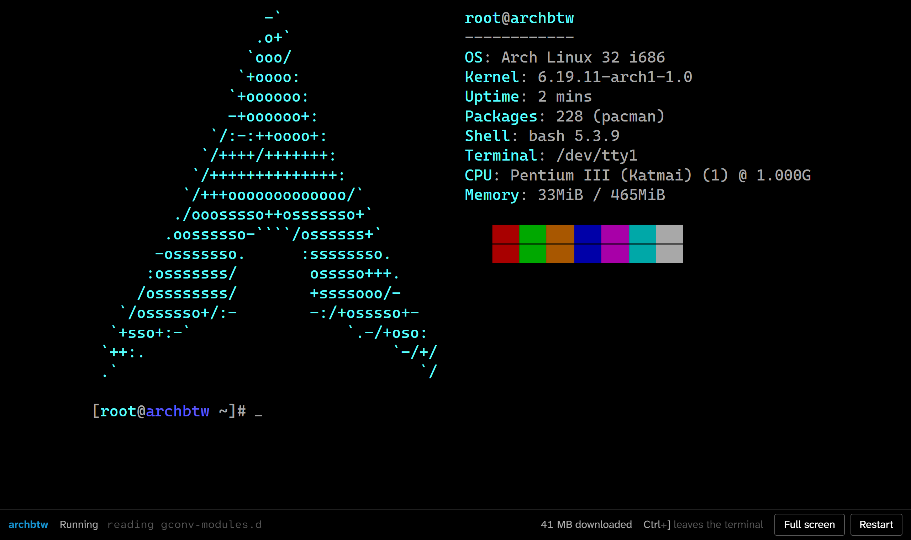
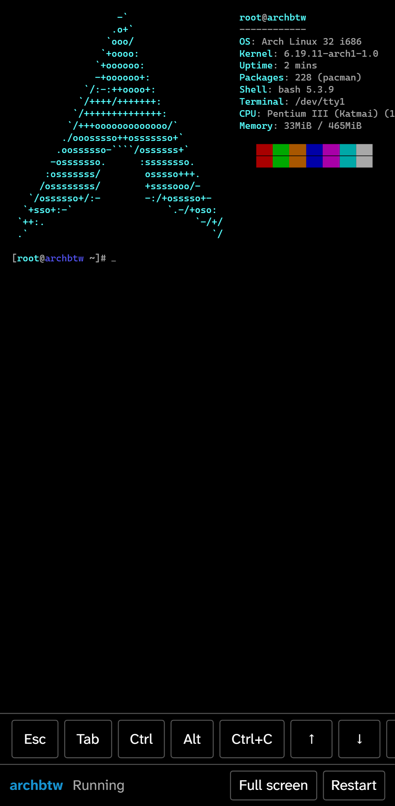

# archbtw

**A real Arch Linux, running in your browser.** → https://hammadshakeelai.github.io/archbtw/

<p align="center"><a href="https://hammadshakeelai.github.io/archbtw/"></a></p>

Not a simulated terminal. archbtw boots an actual i686 [Arch Linux 32](https://archlinux32.org) — kernel, systemd, bash, pacman — in the [v86](https://github.com/copy/v86) PC emulator, and drops you at a root shell with a pile of toys already installed:

`sl` · `cmatrix` · `nyancat` · `asciiquarium` · `pipes` · `fortune | cowsay` · `figlet | lolcat` · `neofetch` · `fastfetch` · bsd-games (`snake`, `worm`, `robots`, `hangman`, `atc`, `adventure`…) · `htop` · `vim` · `tmux` · `fish` · `zsh` · `w3m`

There's no network inside the machine (a static site can't give it one), so `pacman -S` can't reach a mirror. `pacman -Q`, `-Qi`, `-Ql` and `-Ss` all work offline.



## Using it

- **On a computer**, just type. Tab goes to the shell, so press **Ctrl+]** to move focus out to the page's buttons, and click the terminal to type again.
- **On a phone or tablet**, tap the terminal to bring up the keyboard. The key bar adds the keys phone keyboards lack: Esc, Tab, Ctrl, Alt, Ctrl+C and the arrows. Ctrl and Alt stay pressed for the next letter you type.
- **Restart** gives you a fresh machine. Nothing is saved between visits.

After every deploy it's tested against the live site in Chromium, Firefox and WebKit (the engines behind Chrome and Edge, Firefox, and Safari), on a desktop, an Android phone, an iPhone and an iPad.

## How it loads in seconds

- **No disk image.** The root filesystem is served over v86's 9p transport: thousands of small, content-addressed, zstd-compressed files. The machine only downloads the files it actually reads.
- **No boot.** The guest was booted once at build time and its memory saved. Your browser resumes that snapshot straight at the prompt.

## How it's built

| Step | Where |
| --- | --- |
| Resolve the package list against archlinux32's i686 repos and price it against the 1 GB Pages limit | `scripts/resolve.mjs`, `scripts/manifest.mjs` |
| Verify every package's signature against Arch Linux 32's pinned master keys, install them with the guest's own pacman in a chroot, configure a 9p root, strip, convert to 9p | `scripts/rootfs.sh`, `rootfs/trusted-keys.txt` |
| Boot it headless under v86 and save the snapshot | `scripts/snapshot.ts` |
| Publish both as a release, record it in `images.lock.json`, deploy | `.github/workflows/rootfs.yml` |
| Download the guest, build the site, boot it in Chromium on desktop and Android, deploy to Pages | `.github/workflows/deploy.yml` |
| Test the live site in Chromium, Firefox and WebKit on desktop, Android, iPhone and iPad; check the manifest still resolves | `.github/workflows/health.yml` |

The design and the reasoning behind it are in [`docs/superpowers/specs/2026-09-16-archbtw-design.md`](docs/superpowers/specs/2026-09-16-archbtw-design.md).

## Development

Requires Node 24.

```bash
npm install
npm run images     # download the built guest into public/images/
npm run dev        # http://localhost:4321/archbtw/
npm test
npm run build && npm run test:e2e                     # every browser and device
npx playwright test --project=desktop-firefox         # just one
SITE_URL=https://hammadshakeelai.github.io/archbtw/ npx playwright test   # against the live site
npm run screenshots                                   # README images and the social preview
```

To change what's installed, edit `scripts/manifest.mjs`, check it with `npm run resolve` (and `npm run why <package>` to see what pulls something in), then run the **Build guest** workflow.

## License

MIT. The guest's packages keep their own licenses — see [THIRD_PARTY_NOTICES.md](THIRD_PARTY_NOTICES.md). archbtw is a fan project, not affiliated with Arch Linux.
